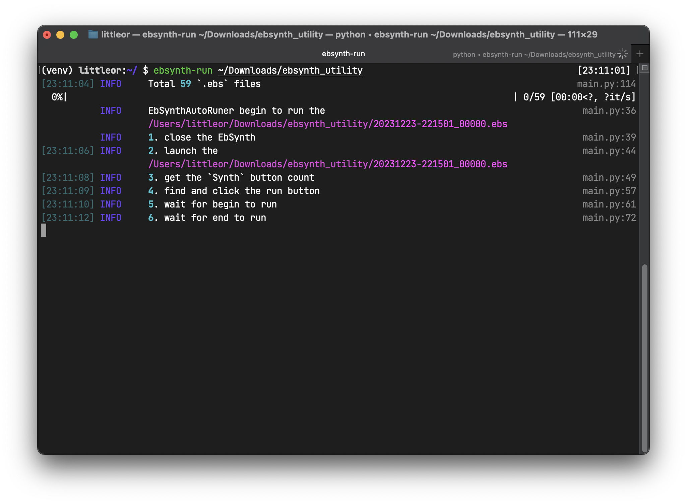

<h1 align="center">
  EbSynth Auto Runer
</h1>
<p align="center">
<a href="https://github.com/Littleor/ebsynth-auto-runer/blob/master/LICENSE" target="blank">

</a>
<a href="https://github.com/Littleor/ebsynth-auto-runer/fork" target="blank">

</a>
<a href="https://github.com/Littleor/ebsynth-auto-runer/stargazers" target="blank">

</a>
<a href="https://github.com/Littleor/ebsynth-auto-runer/issues" target="blank">

</a>
<a href="https://github.com/Littleor/ebsynth-auto-runer/pulls" target="blank">

</a>
</p>

---

This is a tool that can help you automate running [EbSynth](https://ebsynth.com/) on your Mac to process the `.ebs`
files generated in the [ebsynth_utility](https://github.com/s9roll7/ebsynth_utility) extension.



## 🛠️ Installation

First, you need to install [EbSynth](https://ebsynth.com/) on your Mac, and move the `EbSynth.app` to
the `/Applications` folder.

Then, all you need is Python 3.6+ and pip, and just run the following commands in you Terminal:

```bash
pip install ebsynth-auto-runer
```

## 🚀 Usage

Fist, you should give the `Screen Recording`
and `Accessibility` permission to the `Terminal` app to control your Mac, and you can do this in
the `System Preferences` -> `Security & Privacy` -> `Privacy` -> `Screen Recording` and `Accessibility`.

Then, you should generate the keyframes and `.ebs` files with the `ebsynth_utility` extension.

Finally, you should open the `Terminal` app, and `cd` to the `ebsynth-auto-runer` project folder, and run the following
command in your Terminal to start the automation:

```bash
# You should replace the /path/to/your/project with your own path which is also the `ebsynth_utility` project path
ebsynth-run /path/to/your/project
```

> If you forget to give the permission to the `Terminal` app, the macOS will ask you to grant the `Screen Recording`
> and `Accessibility` permission to the `Terminal` app, and you should retry after you grant the permission.

If you want to know more about the arguments, just run the following command in your Terminal:

```bash
python main.py --help
```

## ⚠️ NOTE

* Please check the permission of the `Terminal` app before you run the `EbSynth` automation, and you should give
  the `Screen Recording` and `Accessibility` permission to the `Terminal` app.
* You can freely to use your Mac while the `EbSynth` is running, but you should make the `EbSynth` window show at the
  top
  of the screen when the `EbSynth` ends the current `.ebs` file processing.

## 📖 Manual Installation & Usage

Clone the project and install the requirements:

```bash
# Clone and cd
git clone https://github.com/Littleor/ebsynth-auto-runer.git
cd ebsynth-auto-runer

# If you want to use venv
python3 -m venv venv
source venv/bin/activate

# Install requirements
pip install -r requirements.txt
```

Run the following command to start the automation:

```bash
# You should replace the /path/to/your/project with your own path which is also the `ebsynth_utility` project path
python main.py /path/to/your/project
```

## 📝 TODO

* Add a GUI
* Support Windows
* Support Linux? (If the `EbSynth` supports Linux)

## 🤝 Contributing

Contributions, issues and feature requests are welcome!

## 📚 License

This project is Apache-2.0 licensed.


